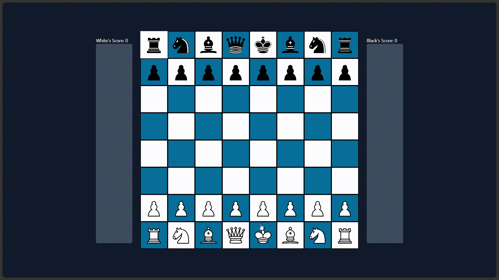

# ♟️ React Chess Game

A full-featured chess game built from scratch using React.  
All game logic, board setup, piece movement, capturing, and score tracking are implemented manually — no external chess libraries used!

## 🚀 Features

- Interactive chess board UI
- Custom game logic for each piece
- Turn-based movement with highlighting
- Capture tracking with live scores
- Castling and check detection
- Fully responsive and customizable

## ✅ Tech Stack

- **Frontend:** React + Tailwind CSS
- **Logic:** Pure JavaScript (OOP-based board, pieces, and move validation)
- **State Management:** React `useState`, `useEffect`

## 📸 Screenshots



## ⚒️ Still in Progress

- [ ] **Castling logic**: Add path obstruction checks  
- [ ] **Check rule enforcement**: Restrict moves to only those that escape check  
- [ ] **Pawn promotion**: Implement choice of piece on reaching the final rank  

## 📁 Project Structure

### frontend

```bash
/src
├── components/
│ └── BoardUI.jsx # Main board UI with state handling
│ └── socket.js   # To be used for realtime game handling
├── logic/
│ ├── Board.js         # Board class and structure
│ ├── Piece.js         # Base class for chess pieces
│ ├── MoveValidator.js # Core move validation logic
│ └── checkFinder.js   # Check detection logic
└── App.jsx
```

### backend

Still under development

## 🧠 Learning Goals

This project is a personal challenge to:

- Understand chess rules deeply
- Apply object-oriented programming in JavaScript
- Handle stateful UI logic with React
- Design reusable game logic components
- Use services like socket.io to understand websockets

## 📌 How to Run

Follow the steps below to run the project locally on your machine:

### 1. Clone the Repository

If you haven't already cloned the project from GitHub, run:

```bash
git clone https://github.com/Athul-Kesav/chessly.git
cd chessly\chess_frontend\
```

### 2. Install Dependencies

```bash
npm install
```

This will install all packages listed in package.json.

### 3. Start the Development Server

```bash
npm run dev
```

This will start a local development server. By default, the app will be available at:

```bash
http://localhost:5173
```
